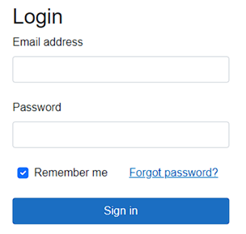

# Secure Login Components With Backend Authorizer
This Blazor Components is built to aid authentication process with the through prebuilt Razor Components

## Installation
You can use built dll or clone this repo into your solution then add as project reference

## Razor Components:
You can use these Components to aid in Development

### Base Properties:
Every component has these properties:
- DivClass: is passed to the base container ``` <div> ``` of the said component 

### Login
Standard Login with 2FA being timed One Time Password<br>

<br>


```Razor
<Login DivClass="w-50" RedirectSuccessLogin="/todoList" ForgotPasswordRef="/forgotPassword" />
```
### Register
Register components with this regex as a password validation checker
```Regex
^(?=.*[a-z])(?=.*[A-Z])(?=.*\d)(?=.*[@$!%*?&])[A-Za-z\d@$!%*?&]{8,}$
```

```razor
<Register DivClass="w-50" userObject="userReg"  TitleText="Register"></Register>
```
### ResetPassword
This Component will send request to the backend to do a reset password process through timed OTP which is sent via SMTP
<br>
```razor
<ResetPassword DivClass="w-50" TitleText="Forgot Password"></ResetPassword>
```

### RedirectToLogin
This Component will redirect to login page when unauthorized access is requested
```razor
<RedirectToLogin />
```


### LogOutButton
This Component will clear stored JWT Token and clear all authorization stored in the blazor app<br>

```razor
<LogOutButton />
```

### LoginSSO
This Component is used to send SSO link to the registered email.

```razor
@page "/sso"
@page "/sso/{userName}/{sso}"

<LoginSSO OTP="@sso" userName="@userName"></LoginSSO>

@code {
    [Parameter]
    public string userName { get; set; } = "";

    [Parameter]
    public string sso { get; set; } = "";
}
```


## Injected Backend Endpoints
Backend Endpoints are injected automatically when setted up correctly.

The prerequisite for using this backend API is as following (MySQL as an example DB):
```csharp
builder.Services.AddMvc().AddApplicationPart(Assembly.Load(new AssemblyName("SecureBackEndAuthorizer")));

var connectionString = JsonRead.AppSetting.GetValue<string>(MainSettings.Database);
var serverVersion = new MySqlServerVersion(new Version(10, 11, 3));
builder.Services.AddDbContext<UserContext>(options =>
{
    options.UseMySql(connectionString, serverVersion, a => a.MigrationsAssembly("BEAPIDemo"));
}, ServiceLifetime.Scoped);
UserContext.options =
    new DbContextOptionsBuilder<UserContext>().UseMySql(connectionString, serverVersion, a
        => a.MigrationsAssembly("BEAPIDemo")).Options;
SMTPSettings.SenderEmail = JsonRead.AppSetting.GetValue<string>(MainSettings.SMTPSender);
SMTPSettings.SenderPassword = JsonRead.AppSetting.GetValue<string>(MainSettings.SMTPPassword);
SMTPSettings.Server = JsonRead.AppSetting.GetValue<string>(MainSettings.SMTPServer);
SMTPSettings.Port = JsonRead.AppSetting.GetValue<int>(MainSettings.SMTPPort);

builder.Services.AddAuthentication(options =>
{
    options.DefaultAuthenticateScheme = JwtBearerDefaults.AuthenticationScheme;
    options.DefaultChallengeScheme = JwtBearerDefaults.AuthenticationScheme;
}).AddJwtBearer(options =>
{
    options.TokenValidationParameters = new TokenValidationParameters
    {
        // Set your token validation parameters
        ValidateIssuer = true,
        ValidIssuer = MainSettings.JWTIssuer,
        ValidateAudience = true,
        ValidAudience = MainSettings.JWTAudience,
        IssuerSigningKey = new SymmetricSecurityKey(Encoding.UTF8.GetBytes(MainSettings.JWTSecretKey)),
        ValidateIssuerSigningKey = true
    };
});


var app = builder.Build();

```

For easier usage, enable the swagger API to see all the added endpoints

### ChangePassword
Used to change password
```json
{
  "otp": "string",
  "email": "string",
  "password": "string"
}
```

### Login
Used to do login attempt. By Default, will proceed to OTP process
```json
{
  "id": "string",
  "password": "string"
}
```
### Register
Used to make a new account
```json
{
  "id": 0,
  "email": "string",
  "password": "string",
  "username": "string",
  "birthday": "2023-08-21T17:13:25.399Z",
  "phoneNumber": "string",
  "locked": true
}
```

### ReqOTP
Used to request OTP via username
```json
"string"
```

### ReqOTPEmail
Used to Request OTP via email
```json
"string"
```

### ReqSSO
Used to Request SSO link sent via SMTP
Sent these parameters to endpoint:
- userName
- baseURL (setup via Navigation manager)

### VerifOTP
Used to verify OTP Requests
```json
{
  "id": "string",
  "otp": "string"
}
```

### VerifOTPuName
Used to verify OTP Requests made with username
```json
{
  "id": "string",
  "otp": "string"
}

```

### verifSSO
```json
{
  "id": "string",
  "otp": "string"
}
```

